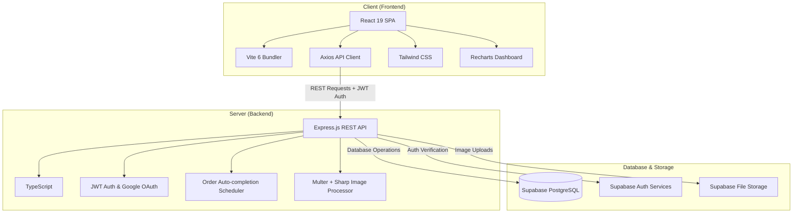
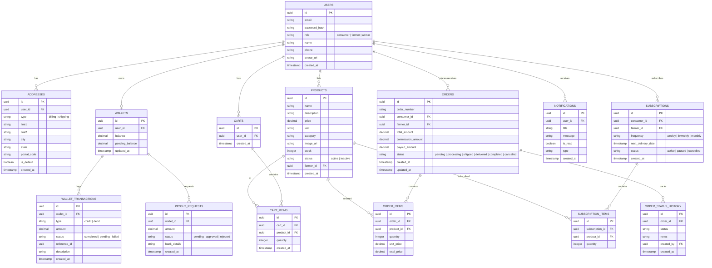

# 🌾 AgriConnect

AgriConnect is a full-stack agricultural marketplace platform that connects farmers and consumers directly. By eliminating intermediaries, the platform enables farmers to receive better returns on their produce while providing consumers with access to fresh goods at fair prices.

---

## ⚙️ System Architecture

AgriConnect uses a decoupled client-server architecture built entirely with TypeScript:

- **Frontend Client**: A single-page React application that communicates with the API via a centralized Axios client. It uses Tailwind CSS for styling and Recharts for interactive farmer and admin dashboards.
- **Backend API**: An Express.js server written in TypeScript that manages REST endpoints, handles user authentication, and runs scheduled tasks (like order status updates) using a cron scheduler.
- **Database & Storage**: Powered by Supabase, providing PostgreSQL database hosting, authentication, and file storage for product images and profile avatars.

---

## 📊 Database Schema

The relational database structure in Supabase PostgreSQL manages users, products, carts, orders, subscriptions, wallets, and notifications:

---

## 🎯 Core Features

### 🛒 Marketplace & Cart
- Direct access to local farmer product catalogs.
- Streamlined shopping cart checkouts linking consumers with matching farmers.

### 📅 Subscriptions
- Recurring scheduled orders (weekly, bi-weekly, monthly) to automate fresh food deliveries.

### 💼 Farmer Earnings & Wallet
- Secure balance ledgers for farmers showing credits, debits, pending balances, and transaction history.
- Built-in payout withdrawal request workflows.

### 🔔 In-App Notifications
- Direct, real-time-like notifications regarding order tracking updates, delivery status changes, and platform announcements.

### 📊 Admin Analytics
- High-level dashboards for administrators to track order counts, registered users, and system performance.
